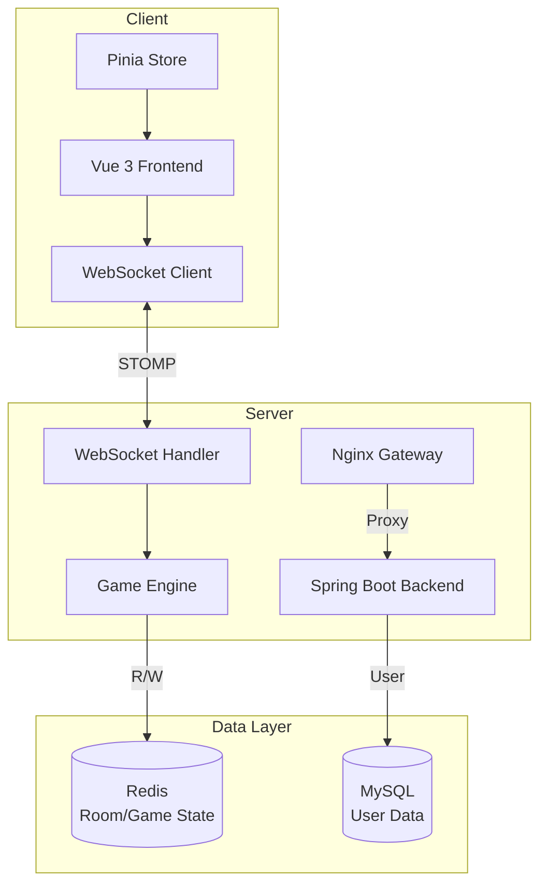
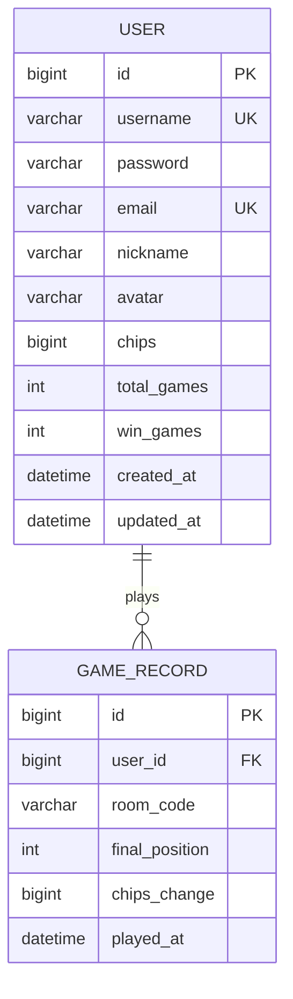

# Texas Hold'em Poker

<p align="center">
  
</p>

<p align="center">
  
  
  
  
  
  
</p>

> 🃏 A full-stack online Texas Hold'em poker platform with room creation, real-time gameplay, chip management, and WebSocket bidirectional communication.

---

## 📌 Project Overview

### Project Name & Slogan

**Texas Hold'em Poker** — A clean and elegant online Texas Hold'em combat platform

### Project Background

With the rapid growth of online card games, real-time performance and interactivity have become core demands for user experience. This project aims to provide a high-performance, scalable Texas Hold'em combat system using a frontend-backend separated architecture with WebSocket for true real-time communication.

### Core Values

- 🎯 **Real-time Combat**: WebSocket bidirectional communication, server as the single source of truth, ensuring game state consistency
- ⚡ **Smooth Experience**: All-In fast-forward mechanism, intelligent side pot settlement, supporting multiple players online
- 🔐 **Secure & Reliable**: JWT stateless authentication, BCrypt password encryption, complete exception handling system
- 🚀 **Easy to Extend**: Modular design, game logic decoupled from communication layer, facilitating feature expansion

### Target Audience

- Developers interested in card game development
- Learners wanting to study Spring Boot + Vue 3实战项目
- Researchers wanting to understand WebSocket real-time communication technology

---

## 📋 Changelog

### v1.0.0 (2024-12-19)

**New Features**

- ✨ User registration / login (JWT authentication)
- ✨ Create room / join room / leave room
- ✨ Complete game state machine (PRE_FLOP → FLOP → TURN → RIVER → SHOWDOWN)
- ✨ Betting actions: FOLD / CHECK / CALL / RAISE / ALL_IN
- ✨ Side pot settlement & uncalled bet return
- ✨ Early win on fold
- ✨ All-In fast-forward
- ✨ Rebuy
- ✨ WebSocket real-time sync

**Technical Upgrades**

- 🔧 Spring Boot 3.2 + Java 17
- 🔧 Vue 3.4 + Vite 5.0
- 🔧 Spring Data Redis for room state caching
- 🔧 STOMP protocol WebSocket communication

---

## 🎮 Features Demo

### Screenshots

> 📁 All screenshots are stored in `./docs/screenshots/`

| Screenshot                                           | Description                  |
| ---------------------------------------------------- | ---------------------------- |
|  | Login/Register - User auth   |
|               | Lobby - Room list & create   |
|   | Create Room - Game settings  |
|       | Game Room - Real-time combat |
|          | Gameplay - Betting actions   |
|               | Rebuy - Chip replenishment   |
|         | Showdown - Results & chips   |

### Online Demo

> 🎮 **Live Demo**: [Coming Soon]

---

### Feature List

#### User System

- 🔑 User registration / login (JWT stateless authentication)
- 👤 User information management
- 💰 Chip management (1000 chips on registration)

#### Room System

- 🏠 Create room (configurable: small blind / big blind / min buy-in / max buy-in / max players)
- 🚪 Join room / leave room
- 📋 Room list (real-time display of all open rooms in lobby)
- 💎 Rebuy (only available during waiting stage)

#### Game Logic

| Feature      | Description                                       |
| ------------ | ------------------------------------------------- |
| Game State   | WAITING → PRE_FLOP → FLOP → TURN → RIVER → SHOWDOWN |
| FOLD         | Fold, lose the round                              |
| CHECK        | Check (only available before someone bets)       |
| CALL         | Call                                             |
| RAISE        | Raise (customizable amount)                       |
| ALL_IN       | All-in, triggers fast-forward                     |
| Side Pot     | Multi-pool distribution, side pot merging         |
| Uncalled Bet | Auto-return overpaid chips                       |
| Early Win    | Win by default when opponents fold               |
| Fast-forward | Auto fast-deal after All-In                      |

#### Real-time Communication

- 🔌 WebSocket bidirectional communication (STOMP protocol)
- 📡 Real-time game state sync
- 👥 Online player status
- 📝 Game record persistence

---

## 🏗️ Technical Architecture

### System Architecture Diagram



### Technology Stack

#### Backend

| Technology        | Version | Description        |
| ----------------- | ------- | ------------------ |
| Spring Boot       | 3.2     | Core framework     |
| Java              | 17+     | Programming language |
| Spring Data JPA   | -       | ORM persistence    |
| Spring Data Redis | -       | Redis cache        |
| Spring Security   | 6.x     | Security auth      |
| Spring WebSocket  | -       | Real-time comm    |
| JJWT              | 0.12.x  | JWT token handling |
| BCrypt            | -       | Password encryption |

#### Frontend

| Technology   | Version | Description        |
| ------------ | ------- | ------------------ |
| Vue          | 3.4     | Core framework    |
| Vite         | 5.0     | Build tool        |
| Pinia        | 2.1     | State management  |
| Vue Router   | 4.2     | Route management  |
| Element Plus | 2.4     | UI component lib  |
| Axios        | 1.14    | HTTP client       |

#### Infrastructure

| Component | Version | Description        |
| --------- | ------- | ------------------ |
| MySQL     | 8.0+    | Relational database |
| Redis     | 6.0+    | Cache/session store |

---

## 📁 Project Structure

```
Texas holdem poker/
├── docs/                              # 📂 Documentation
│   └── screenshots/                   # 📸 Screenshots
│       ├── login-register.png         # Login/Register page
│       ├── lobby.png                   # Lobby page
│       ├── create-room.png            # Create room
│       ├── game-room.png              # Game page
│       ├── gameplay.png               # Real-time combat
│       ├── rebuy.png                  # Rebuy
│       └── showdown.png               # Showdown
│
├── poker-backend/                      # 🟢 Spring Boot Backend
│   └── src/main/java/com/poker/
│       ├── PokerApplication.java      # 🚀 Main class
│       │
│       ├── config/                    # ⚙️ Configuration
│       │   ├── RedisConfig.java       # Redis config
│       │   ├── SecurityConfig.java    # Security config
│       │   ├── WebSocketConfig.java   # WebSocket config
│       │   ├── JwtConfig.java         # JWT config
│       │   ├── JwtAuthFilter.java     # JWT auth filter
│       │   ├── JacksonConfig.java    # JSON serialization
│       │   └── WebMvcConfig.java     # Web MVC config
│       │
│       ├── controller/               # 🎮 REST API Controllers
│       │   ├── AuthController.java    # Auth endpoints
│       │   ├── UserController.java   # User endpoints
│       │   └── RoomController.java   # Room endpoints
│       │
│       ├── service/                   # 📋 Business logic
│       │   ├── UserService.java      # User service
│       │   ├── RoomService.java      # Room service
│       │   └── GameRecordService.java # Game record service
│       │
│       ├── game/                      # 🎯 Core game module
│       │   ├── engine/
│       │   │   ├── GameEngine.java    # Game engine (state machine)
│       │   │   ├── BettingManager.java # Betting manager
│       │   │   └── SidePotManager.java # Side pot manager
│       │   ├── logic/
│       │   │   ├── Deck.java          # Deck management
│       │   │   ├── HandEvaluator.java  # Hand evaluation
│       │   │   └── PokerLogic.java     # Poker logic
│       │   ├── model/
│       │   │   ├── Card.java         # Card model
│       │   │   ├── Player.java       # Player model
│       │   │   ├── Room.java         # Room model
│       │   │   ├── GameState.java    # Game state model
│       │   │   └── SidePot.java     # Side pot model
│       │   └── enums/
│       │       ├── GamePhase.java   # Game phase enum
│       │       └── PlayerAction.java # Player action enum
│       │
│       ├── websocket/                 # 🔌 WebSocket communication
│       │   └── handler/
│       │       └── GameWebSocketHandler.java # Game message handler
│       │
│       ├── entity/                    # 🗃️ JPA entities
│       │   ├── User.java             # User entity
│       │   └── GameRecord.java       # Game record entity
│       │
│       ├── dto/                       # 📦 Data transfer objects
│       │   ├── LoginDTO.java
│       │   ├── RegisterDTO.java
│       │   └── RoomDTO.java
│       │
│       ├── repository/                # 💾 Data access layer
│       │   ├── UserRepository.java
│       │   ├── RoomRepository.java
│       │   └── GameRecordRepository.java
│       │
│       ├── common/                    # 🔧 Common components
│       │   ├── ErrorCode.java        # Error codes
│       │   ├── Result.java           # Unified response
│       │   └── Utils.java            # Utilities
│       │
│       └── exception/                 # ⚠️ Exception handling
│           ├── BusinessException.java
│           └── GlobalExceptionHandler.java
│
├── poker-vue/                          # 🔵 Vue 3 Frontend
│   ├── public/
│   │   └── index.html
│   │
│   └── src/
│       ├── api/                       # 🌐 HTTP API wrapper
│       │   ├── request.js            # Axios instance config
│       │   ├── auth.js              # Auth endpoints
│       │   ├── user.js              # User endpoints
│       │   └── room.js              # Room endpoints
│       │
│       ├── assets/                    # 📁 Static assets
│       │
│       ├── components/                # 🧩 Common components
│       │   ├── ActionPanel.vue       # Action panel (Fold/Check/Call/Raise/AllIn)
│       │   ├── CommunityCards.vue   # Community cards display
│       │   ├── PlayerSeat.vue        # Player seat
│       │   └── PokerCard.vue        # Poker card component
│       │
│       ├── router/
│       │   └── index.js             # Route configuration
│       │
│       ├── store/                     # 📊 Pinia state management
│       │   ├── userStore.js         # User state
│       │   ├── roomStore.js        # Room state
│       │   └── gameStore.js        # Game state
│       │
│       ├── utils/                     # 🔧 Utilities
│       │   └── request.js           # HTTP request wrapper
│       │
│       ├── views/                     # 📄 Page components
│       │   ├── Login.vue            # Login page
│       │   ├── Register.vue         # Register page
│       │   ├── Lobby.vue           # Lobby page
│       │   └── Game.vue            # Game page
│       │
│       ├── websocket/                 # 🔌 WebSocket client
│       │   ├── ws.js                # WebSocket connection
│       │   └── messageTypes.js     # Message types
│       │
│       ├── App.vue                    # Root component
│       └── main.js                    # Entry file
│
├── .gitignore
├── LICENSE
└── README.md                          # 📖 English documentation
```

---

## 🚀 Quick Start

### Environment Requirements

| Component | Minimum | Recommended |
|-----------|---------|-------------|
| JDK       | 17      | 17.0.8+     |
| Node.js   | 18      | 18.20.0+    |
| npm       | 9       | 10.0.0+     |
| MySQL     | 8.0     | 8.0.35+     |
| Redis     | 6.0     | 7.0+        |
| Gradle    | 8.5     | 8.5+        |

### 1. Clone Project

```bash
git clone https://github.com/youqingwei111/Texas-holdem-poker.git
cd Texas-holdem-poker
```

### 2. Backend Configuration & Startup

#### 2.1 Database Initialization

```sql
-- Login to MySQL
mysql -u root -p

-- Create database
CREATE DATABASE poker DEFAULT CHARACTER SET utf8mb4 COLLATE utf8mb4_unicode_ci;

-- Verify
SHOW DATABASES;
```

#### 2.2 Configure Environment Variables

The project uses `.env` file for configuration management. Copy the example file and modify it:

```bash
cd poker-backend
cp .env.example .env
```

Edit `.env` file:

```bash
# Database Configuration
DB_URL=jdbc:mysql://localhost:3306/poker?useUnicode=true&characterEncoding=utf8&serverTimezone=Asia/Shanghai&useSSL=false
DB_USERNAME=root          # ⚠️ Change to your MySQL username
DB_PASSWORD=your_password  # ⚠️ Change to your MySQL password

# Redis Configuration
REDIS_HOST=localhost
REDIS_PORT=6379

# JWT Configuration
JWT_SECRET=your_secret_key_here_at_least_32_characters
JWT_EXPIRATION=86400000
```

> ⚠️ The `.env` file is NOT committed to Git (added to .gitignore). Do not share sensitive information.

#### 2.3 Start Backend

**Option 1: Command Line (Gradle)**
```bash
cd poker-backend

# Development mode
./gradlew bootRun

# Build and run (production)
./gradlew build
java -jar build/libs/poker-backend-0.0.1-SNAPSHOT.jar
```

**Option 2: IntelliJ IDEA**
1. Open IntelliJ IDEA, select `File` → `Open`, choose `poker-backend` directory
2. Wait for Gradle dependencies to download
3. Find `PokerApplication.java` in project structure
4. Right-click and select `Run 'PokerApplication.main()'`
5. Or click the green run button above the main class

Backend started successfully:
```
🍀 Started PokerApplication in 5.234 seconds
🌐 Backend running at: http://localhost:8080
```

### 3. Frontend Configuration & Startup

```bash
cd poker-vue

# Install dependencies
npm install

# Development mode
npm run dev

# Production build
npm run build
```

Frontend started successfully:
```
🌐 Frontend running at: http://localhost:5173
```

### 4. Access

Open browser and visit: `http://localhost:5173`

### 5. Default Account

Test data is automatically imported on startup for demo and testing:

| Username | Password | Chips | Usage           |
|----------|----------|-------|-----------------|
| player1  | 123456   | 1000  | Demo account 1  |
| player2  | 123456   | 1000  | Demo account 2  |
| player3  | 123456   | 1000  | Demo account 3  |
| test     | 123456   | 1000  | Test account    |

> 💡 If the database already has data, test data import will be skipped automatically.

---

## 📖 Developer Guide

### Local Development Setup

#### Backend Development

1. IDE: IntelliJ IDEA or VS Code + Gradle plugin
2. Ensure MySQL 8.0 and Redis 6.0+ are running
3. Import Gradle project (select `build.gradle`), wait for dependencies to download
4. Copy `poker-backend/.env.example` to `.env`, modify database connection info
5. Run `PokerApplication.main()` to start

#### Frontend Development

1. IDE: VS Code
2. Install Vue official plugins: Volar, ESLint, Prettier
3. Run `npm install` to install dependencies
4. Run `npm run dev` to start dev server
5. Code changes will hot-reload automatically

### API Documentation

**Swagger UI**: `http://localhost:8080/swagger-ui.html`
**API Docs (JSON)**: `http://localhost:8080/v3/api-docs`

#### API Endpoints

**Auth Endpoints `/api/auth`**

| Method | Path            | Description    | Auth |
|--------|-----------------|----------------|------|
| POST   | /api/auth/register | Register user  | ❌   |
| POST   | /api/auth/login    | User login     | ❌   |

**User Endpoints `/api/user`**

| Method | Path         | Description        | Auth |
|--------|-------------|--------------------|------|
| GET    | /api/user/me | Get current user   | ✅   |

**Room Endpoints `/api/room`**

| Method | Path                      | Description        | Auth |
|--------|---------------------------|--------------------|------|
| GET    | /api/room/all             | Get room list      | ❌   |
| GET    | /api/room/{roomCode}      | Get room details   | ❌   |
| POST   | /api/room/create          | Create room        | ✅   |
| POST   | /api/room/join/{roomCode} | Join room          | ✅   |
| POST   | /api/room/leave/{roomCode}| Leave room         | ✅   |
| POST   | /api/room/rebuy           | Rebuy chips        | ✅   |

#### Request Examples

**Register User**
```bash
curl -X POST http://localhost:8080/api/auth/register \
  -H "Content-Type: application/json" \
  -d '{
    "username": "player1",
    "password": "123456",
    "email": "player1@example.com",
    "nickname": "Player One"
  }'
```

**User Login**
```bash
curl -X POST http://localhost:8080/api/auth/login \
  -H "Content-Type: application/json" \
  -d '{
    "username": "player1",
    "password": "123456"
  }'
```

**Get Room List**
```bash
curl http://localhost:8080/api/room/all
```

**Create Room** (requires Bearer Token)
```bash
curl -X POST http://localhost:8080/api/room/create \
  -H "Content-Type: application/json" \
  -H "Authorization: Bearer <YOUR_TOKEN>" \
  -d '{
    "name": "Newbie Room",
    "smallBlind": 50,
    "bigBlind": 100,
    "minBuyIn": 1000,
    "maxBuyIn": 5000,
    "maxPlayers": 6
  }'
```

**Join Room**
```bash
curl -X POST "http://localhost:8080/api/room/join/ROOMCODE?buyInChips=2000" \
  -H "Authorization: Bearer <YOUR_TOKEN>"
```

> 💡 Tip: Visit `http://localhost:8080/swagger-ui.html` in browser for interactive API documentation and testing.

### Database Design

#### ER Diagram



#### Table Structure

**users Table**

| Field       | Type          | Constraints                  | Description              |
|-------------|---------------|-----------------------------|--------------------------|
| id          | BIGINT        | PK, AUTO_INCREMENT          | Primary key              |
| username    | VARCHAR(50)   | UNIQUE, NOT NULL            | Username                 |
| password    | VARCHAR(255)  | NOT NULL                    | Encrypted password       |
| email       | VARCHAR(100)  | UNIQUE                      | Email                    |
| nickname    | VARCHAR(20)   | -                           | Nickname                 |
| avatar      | VARCHAR(200)  | -                           | Avatar URL               |
| chips       | BIGINT        | NOT NULL, DEFAULT 1000      | Current chips            |
| total_games | INT           | NOT NULL, DEFAULT 0         | Total games played       |
| win_games   | INT           | NOT NULL, DEFAULT 0         | Games won                |
| created_at  | DATETIME      | NOT NULL                    | Created timestamp        |
| updated_at  | DATETIME      | NOT NULL                    | Updated timestamp        |

**game_records Table**

| Field         | Type          | Constraints              | Description              |
|---------------|---------------|-------------------------|--------------------------|
| id            | BIGINT        | PK, AUTO_INCREMENT      | Primary key              |
| user_id       | BIGINT        | FK → users.id           | User foreign key         |
| room_code     | VARCHAR(20)   | NOT NULL                | Room code                |
| final_position| INT           | NOT NULL                | Final position           |
| chips_change  | BIGINT        | NOT NULL                | Chip change              |
| played_at     | DATETIME      | NOT NULL                | Played timestamp         |

> 💡 Note: Room data is stored in Redis, not in database tables.

### Frontend Components

| Component      | File                         | Description                    |
|---------------|------------------------------|--------------------------------|
| Login/Register| views/Login.vue              | User login/register            |
| Lobby         | views/Lobby.vue              | Room list, create room         |
| Game          | views/Game.vue               | Core game interface            |
| Action Panel  | components/ActionPanel.vue   | Fold/Check/Call/Raise/AllIn   |
| Player Seat   | components/PlayerSeat.vue    | Player info display            |
| Community Cards| components/CommunityCards.vue| Community cards display       |
| Poker Card    | components/PokerCard.vue     | Single card rendering          |

### Unit Testing

#### Backend Testing

**Option 1: Command Line**
```bash
cd poker-backend

# Run all tests
./gradlew test

# Run single test class
./gradlew test --tests UserServiceTest

# Run tests in specific package
./gradlew test --tests "*Service*"
```

**Option 2: IntelliJ IDEA**
1. Open test class file (e.g., `src/test/java/com/poker/service/UserServiceTest.java`)
2. Right-click on class name or method name, select `Run 'ClassName'` or `Run 'methodName'`
3. Or click the green run button on the left side of the editor
4. Test results are displayed in the `Run` panel at the bottom

---

## 🏭 Deployment Guide

### Production Configuration

#### Backend Configuration

```yaml
spring:
  datasource:
    url: jdbc:mysql://${DB_HOST}:3306/poker?useUnicode=true&characterEncoding=utf8&serverTimezone=Asia/Shanghai&useSSL=true
    username: ${DB_USERNAME}
    password: ${DB_PASSWORD}
    hikari:
      maximum-pool-size: 20
      minimum-idle: 5

  data:
    redis:
      host: ${REDIS_HOST}
      port: ${REDIS_PORT}
      password: ${REDIS_PASSWORD}

server:
  port: 8080
  ssl:
    enabled: true
    key-store: classpath:keystore.p12
    key-store-password: ${KEYSTORE_PASSWORD}
```

#### Frontend Nginx Configuration

```nginx
server {
    listen 80;
    server_name your-domain.com;

    # Frontend static files
    location / {
        root /var/www/poker-vue/dist;
        index index.html;
        try_files $uri $uri/ /index.html;
    }

    # API reverse proxy
    location /api {
        proxy_pass http://localhost:8080;
        proxy_set_header Host $host;
        proxy_set_header X-Real-IP $remote_addr;
    }

    # WebSocket reverse proxy
    location /ws {
        proxy_pass http://localhost:8080/ws;
        proxy_http_version 1.1;
        proxy_set_header Upgrade $http_upgrade;
        proxy_set_header Connection "upgrade";
    }
}
```

### Backend JAR Build & Run

```bash
cd poker-backend

# Clean and build
./gradlew build

# View generated JAR
ls -la build/libs/

# Run in background
nohup java -jar build/libs/poker-backend-0.0.1-SNAPSHOT.jar > app.log 2>&1 &

# View process
ps -ef | grep poker-backend

# View logs
tail -f app.log
```

### Notes

1. ⚠️ Must change JWT secret in production
2. ⚠️ Database password should not be in config file, use environment variables
3. ⚠️ Redis should have password and enable AOF persistence
4. ⚠️ CORS configuration needs adjustment based on actual domain
5. ⚠️ High concurrency scenarios require load balancing + WebSocket clustering

---

## 🤝 Contributing Guide

### How to Contribute

1. 🍴 Fork this repository
2. 🔖 Create feature branch (`git checkout -b feature/AmazingFeature`)
3. 💻 Write code and commit (`git commit -m 'Add some AmazingFeature'`)
4. 📤 Push to branch (`git push origin feature/AmazingFeature`)
5. 🎉 Create Pull Request

### Code Standards

- Follow Google Java Style Guide
- Use ESLint + Prettier for frontend code formatting
- Run tests before committing

### PR Process

1. Ensure local tests pass
2. Provide detailed PR description
3. Wait for Code Review
4. Delete branch after merge

---

## 📄 License

This project is licensed under the [MIT License](./LICENSE).

---

## 📧 Contact

| Method   | Info                                |
|----------|-------------------------------------|
| Author   | chenguanxi111                       |
| Email    | youqingwei111@outlook.com           |
| Issues   | [GitHub Issues](https://github.com/youqingwei111/Texas-holdem-poker/issues) |

---

<p align="center">
  ⭐ If this project is helpful, please give it a Star!
</p>