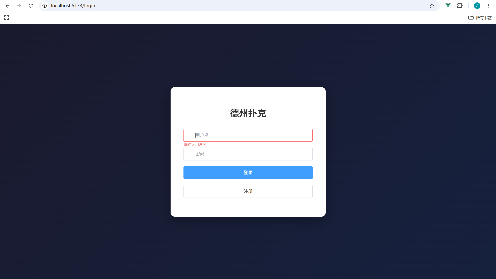
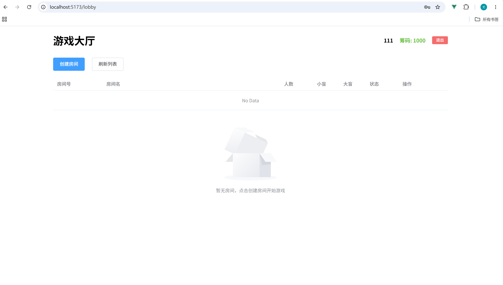
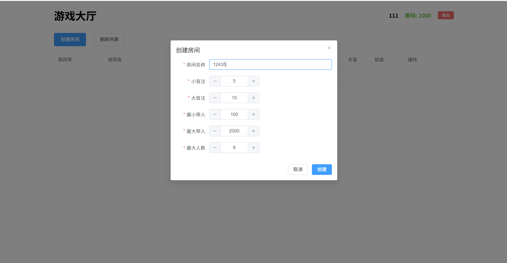
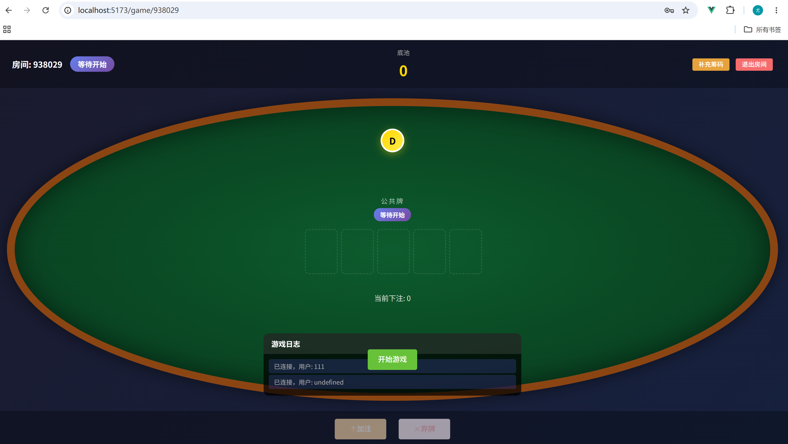
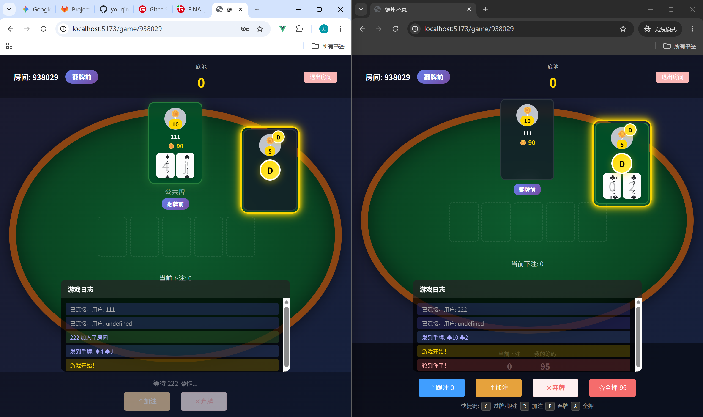
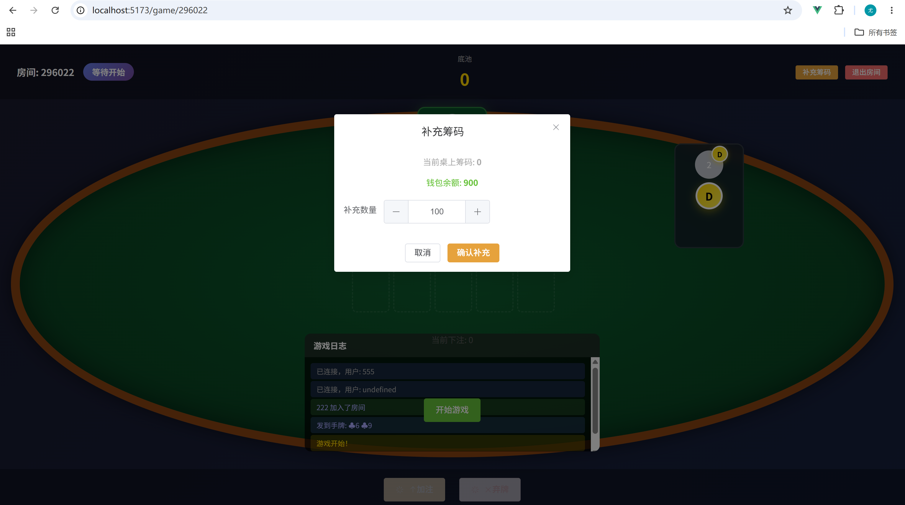
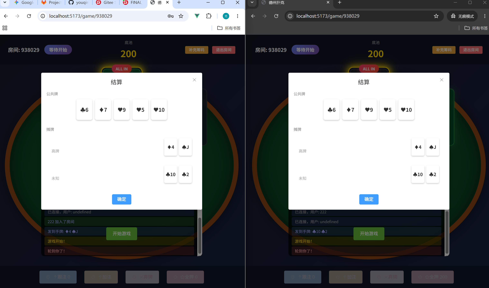
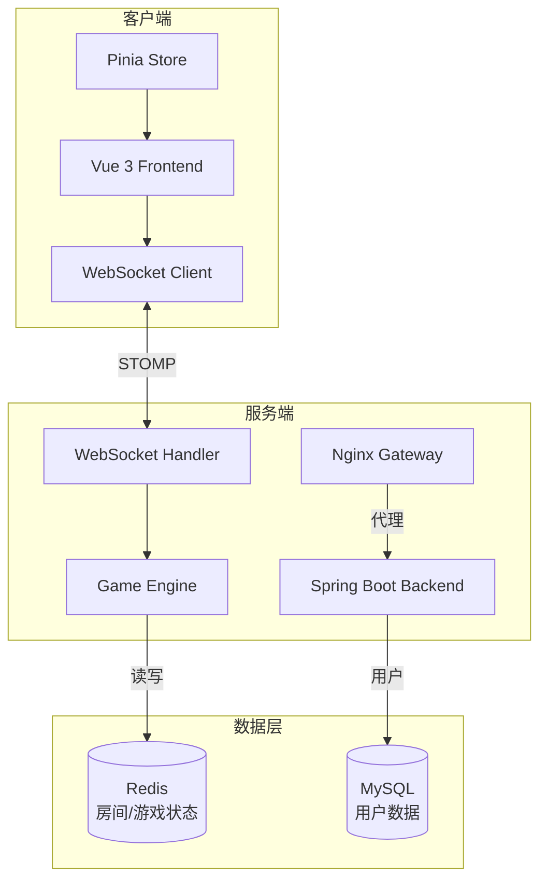
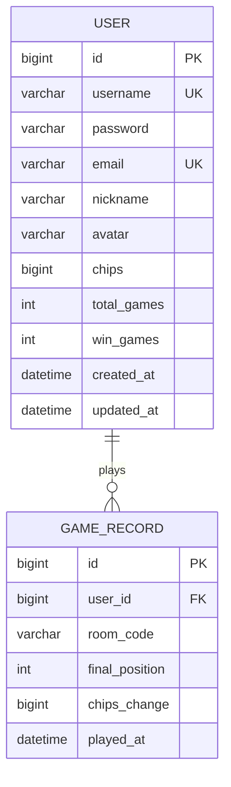

# Texas Hold'em Poker 德州扑克

<p align="center">
  
</p>

<p align="center">
  
  
  
  
  
  
</p>

> 🃏 全栈开发的德州扑克在线游戏平台，支持房间创建、实时对战、筹码管理、WebSocket 双向通信。

---

## 📌 项目概述

### 项目名称与标语

**Texas Hold'em Poker** — 简洁优雅的在线德州扑克对战平台

### 项目背景

随着线上棋牌游戏的蓬勃发展，实时性、交互性成为用户体验的核心需求。本项目旨在提供一个高性能、可扩展的德州扑克对战系统，采用前后端分离架构，使用 WebSocket 实现真正的实时通信。

### 核心价值

- 🎯 **实时对战**：WebSocket 双向通信，服务端作为唯一数据源，保证游戏状态一致性
- ⚡ **流畅体验**：All-In 极速发牌机制，智能边池结算，支持多人同时在线
- 🔐 **安全可靠**：JWT 无状态认证，BCrypt 密码加密，完善的异常处理体系
- 🚀 **易于扩展**：模块化设计，游戏逻辑与通信层解耦，便于功能拓展

### 适用人群

- 对棋牌游戏开发感兴趣的开发者
- 需要学习 Spring Boot + Vue 3 实战项目的学习者
- 希望了解 WebSocket 实时通信技术的研究者

---

## 📋 更新日志

### v1.0.0 (2026-5-19)

**新特性**

- ✨ 用户注册 / 登录（JWT 认证）
- ✨ 创建房间 / 加入房间 / 离开房间
- ✨ 游戏状态机完整实现（PRE_FLOP → FLOP → TURN → RIVER → SHOWDOWN）
- ✨ 下注动作：FOLD / CHECK / CALL / RAISE / ALL_IN
- ✨ 边池结算（Side Pot）与退还未跟注筹码（Uncalled Bet）
- ✨ 弃牌提前获胜（Early Win on Fold）
- ✨ All-In 极速发牌（Fast-forward）
- ✨ 补充筹码（Rebuy）
- ✨ WebSocket 实时同步

**技术升级**

- 🔧 Spring Boot 3.2 + Java 17
- 🔧 Vue 3.4 + Vite 5.0
- 🔧 Spring Data Redis 房间状态缓存
- 🔧 STOMP 协议 WebSocket 通信

> 📌 历史版本请查看 [CHANGELOG.md](./CHANGELOG.md)

---

## 🎮 功能演示

### 项目截图

> 📁 所有截图存放在 `./docs/screenshots/` 目录

| 截图                                                 | 说明                       |
| ---------------------------------------------------- | -------------------------- |
|  | 登录/注册页 - 用户认证入口 |
|               | 大厅页 - 房间列表与创建    |
|       | 创建房间 - 配置游戏参数    |
|         | 游戏页 - 实时对战界面      |
|          | 对战演示 - 下注操作        |
|             | 补充筹码 - Rebuy 操作      |
|            | 结算页 - 胜负与筹码        |

### 在线演示

> 🎮 **在线演示地址**：[待补充演示地址]

---

### 功能特性

#### 用户系统

- 🔑 用户注册 / 登录（JWT 无状态认证）
- 👤 用户信息管理
- 💰 筹码管理（注册即送 1000 筹码）

#### 房间系统

- 🏠 创建房间（可配置：小盲/大盲/最小买入/最大买入/最大玩家数）
- 🚪 加入房间 / 离开房间
- 📋 房间列表（大厅实时展示所有待开放房间）
- 💎 补充筹码（Rebuy，仅等待阶段可用）

#### 游戏逻辑

| 特性         | 说明                                                |
| ------------ | --------------------------------------------------- |
| 游戏状态机   | WAITING → PRE_FLOP → FLOP → TURN → RIVER → SHOWDOWN |
| FOLD         | 弃牌，失去本局                                      |
| CHECK        | 过牌（仅在有人下注前可用）                          |
| CALL         | 跟注                                                |
| RAISE        | 加注（可自定义金额）                                |
| ALL_IN       | 全下，触发极速发牌                                  |
| 边池结算     | 多池分配，支持边池合并                              |
| Uncalled Bet | 自动退还多付的筹码                                  |
| Early Win    | 弃牌提前获胜                                        |
| Fast-forward | All-In 后自动快速发牌                               |

#### 实时通信

- 🔌 WebSocket 双向通信（STOMP 协议）
- 📡 游戏状态实时同步
- 👥 在线玩家状态
- 📝 游戏记录持久化

---

## 🏗️ 技术架构

### 系统架构图



### 技术栈说明

#### 后端

| 技术              | 版本   | 说明         |
| ----------------- | ------ | ------------ |
| Spring Boot       | 3.2    | 核心框架     |
| Java              | 17+    | 编程语言     |
| Spring Data JPA   | -      | ORM 持久层   |
| Spring Data Redis | -      | Redis 缓存   |
| Spring Security   | 6.x    | 安全认证     |
| Spring WebSocket  | -      | 实时通信     |
| JJWT              | 0.12.x | JWT 令牌处理 |
| BCrypt            | -      | 密码加密     |

#### 前端

| 技术         | 版本 | 说明        |
| ------------ | ---- | ----------- |
| Vue          | 3.4  | 核心框架    |
| Vite         | 5.0  | 构建工具    |
| Pinia        | 2.1  | 状态管理    |
| Vue Router   | 4.2  | 路由管理    |
| Element Plus | 2.4  | UI 组件库   |
| Axios        | 1.14 | HTTP 客户端 |

#### 基础设施

| 组件  | 版本 | 说明          |
| ----- | ---- | ------------- |
| MySQL | 8.0+ | 关系数据库    |
| Redis | 6.0+ | 缓存/会话存储 |

---

## 📁 目录结构

```
Texas holdem poker/
├── docs/                              # 📂 文档资源
│   └── screenshots/                   # 📸 项目截图
│       ├── login-register.png         # 登录/注册页
│       ├── lobby.png                   # 大厅页
│       ├── create-room.png            # 创建房间
│       ├── game-room.png              # 游戏页面
│       ├── gameplay.png               # 实时对战
│       ├── rebuy.png                  # 补充筹码
│       └── showdown.png               # 结算页
│
├── poker-backend/                      # 🟢 Spring Boot 后端
│   └── src/main/java/com/poker/
│       ├── PokerApplication.java      # 🚀 启动类
│       │
│       ├── config/                    # ⚙️ 配置模块
│       │   ├── RedisConfig.java       # Redis 配置
│       │   ├── SecurityConfig.java     # 安全配置
│       │   ├── WebSocketConfig.java   # WebSocket 配置
│       │   ├── JwtConfig.java         # JWT 配置
│       │   ├── JwtAuthFilter.java      # JWT 认证过滤器
│       │   ├── JacksonConfig.java      # JSON 序列化配置
│       │   └── WebMvcConfig.java       # Web MVC 配置
│       │
│       ├── controller/                 # 🎮 REST API 控制器
│       │   ├── AuthController.java     # 认证接口（登录/注册）
│       │   ├── UserController.java     # 用户接口
│       │   └── RoomController.java     # 房间接口
│       │
│       ├── service/                    # 📋 业务逻辑层
│       │   ├── UserService.java       # 用户服务
│       │   ├── RoomService.java       # 房间服务
│       │   └── GameRecordService.java # 游戏记录服务
│       │
│       ├── game/                       # 🎯 核心游戏模块
│       │   ├── engine/
│       │   │   ├── GameEngine.java     # 游戏引擎（状态机）
│       │   │   ├── BettingManager.java # 下注管理器
│       │   │   └── SidePotManager.java # 边池管理器
│       │   ├── logic/
│       │   │   ├── Deck.java           # 牌堆管理
│       │   │   ├── HandEvaluator.java  # 牌型判定
│       │   │   └── PokerLogic.java     # 扑克牌逻辑
│       │   ├── model/
│       │   │   ├── Card.java          # 扑克牌模型
│       │   │   ├── Player.java        # 玩家模型
│       │   │   ├── Room.java          # 房间模型
│       │   │   ├── GameState.java     # 游戏状态模型
│       │   │   └── SidePot.java      # 边池模型
│       │   └── enums/
│       │       ├── GamePhase.java     # 游戏阶段枚举
│       │       └── PlayerAction.java  # 玩家动作枚举
│       │
│       ├── websocket/                  # 🔌 WebSocket 通信
│       │   └── handler/
│       │       └── GameWebSocketHandler.java  # 游戏消息处理器
│       │
│       ├── entity/                     # 🗃️ JPA 实体
│       │   ├── User.java              # 用户实体
│       │   └── GameRecord.java        # 游戏记录实体
│       │
│       ├── dto/                        # 📦 数据传输对象
│       │   ├── LoginDTO.java
│       │   ├── RegisterDTO.java
│       │   └── RoomDTO.java
│       │
│       ├── repository/                 # 💾 数据访问层
│       │   ├── UserRepository.java
│       │   ├── RoomRepository.java
│       │   └── GameRecordRepository.java
│       │
│       ├── common/                     # 🔧 公共组件
│       │   ├── ErrorCode.java         # 错误码定义
│       │   ├── Result.java            # 统一响应
│       │   └── Utils.java             # 工具类
│       │
│       └── exception/                  # ⚠️ 异常处理
│           ├── BusinessException.java
│           └── GlobalExceptionHandler.java
│
├── poker-vue/                         # 🔵 Vue 3 前端
│   ├── public/
│   │   └── index.html
│   │
│   └── src/
│       ├── api/                       # 🌐 HTTP API 封装
│       │   ├── request.js             # Axios 实例配置
│       │   ├── auth.js                # 认证接口
│       │   ├── user.js                # 用户接口
│       │   └── room.js                # 房间接口
│       │
│       ├── assets/                    # 📁 静态资源
│       │
│       ├── components/                # 🧩 公共组件
│       │   ├── ActionPanel.vue        # 操作面板（Fold/Check/Call/Raise/AllIn）
│       │   ├── CommunityCards.vue     # 公共牌展示
│       │   ├── PlayerSeat.vue         # 玩家座位
│       │   └── PokerCard.vue          # 扑克牌组件
│       │
│       ├── router/
│       │   └── index.js               # 路由配置
│       │
│       ├── store/                     # 📊 Pinia 状态管理
│       │   ├── userStore.js          # 用户状态
│       │   ├── roomStore.js          # 房间状态
│       │   └── gameStore.js          # 游戏状态
│       │
│       ├── utils/                     # 🔧 工具函数
│       │   └── request.js            # HTTP 请求封装
│       │
│       ├── views/                     # 📄 页面组件
│       │   ├── Login.vue             # 登录页
│       │   ├── Register.vue          # 注册页
│       │   ├── Lobby.vue             # 大厅页
│       │   └── Game.vue              # 游戏页
│       │
│       ├── websocket/                 # 🔌 WebSocket 客户端
│       │   ├── ws.js                 # WebSocket 连接管理
│       │   └── messageTypes.js       # 消息类型定义
│       │
│       ├── App.vue                    # 根组件
│       └── main.js                    # 入口文件
│
├── .gitignore
├── LICENSE
├── README.md                          # 📖 项目文档
└── CHANGELOG.md                       # 📝 更新日志
```

---

## 🚀 快速开始

### 环境要求

| 组件    | 最低版本 | 推荐版本 |
| ------- | -------- | -------- |
| JDK     | 17       | 17.0.8+  |
| Node.js | 18       | 18.20.0+ |
| npm     | 9        | 10.0.0+  |
| MySQL   | 8.0      | 8.0.35+  |
| Redis   | 6.0      | 7.0+     |
| Maven   | 3.9      | 3.9.6+   |

### 1. 项目克隆

```bash
git clone https://github.com/youqingwei111/Texas-holdem-poker.git
cd Texas-holdem-poker
```

### 2. 后端配置与启动

#### 2.1 数据库初始化

```sql
-- 登录 MySQL
mysql -u root -p

-- 创建数据库
CREATE DATABASE poker DEFAULT CHARACTER SET utf8mb4 COLLATE utf8mb4_unicode_ci;

-- 查看数据库
SHOW DATABASES;
```

#### 2.2 配置环境变量

项目使用 `.env` 文件管理配置，复制示例文件并修改：

```bash
cd poker-backend
cp .env.example .env
```

编辑 `.env` 文件：

```bash
# 数据库配置
DB_URL=jdbc:mysql://localhost:3306/poker?useUnicode=true&characterEncoding=utf8&serverTimezone=Asia/Shanghai&useSSL=false
DB_USERNAME=root          # ⚠️ 修改为你的 MySQL 用户名
DB_PASSWORD=your_password # ⚠️ 修改为你的 MySQL 密码

# Redis配置
REDIS_HOST=localhost
REDIS_PORT=6379

# JWT配置
JWT_SECRET=your_secret_key_here_at_least_32_characters
JWT_EXPIRATION=86400000
```

> ⚠️ `.env` 文件不会被提交到 Git（已加入 .gitignore），请勿泄露敏感信息。

#### 2.3 启动后端

**方式一：命令行启动（Gradle）**

```bash
cd poker-backend

# 开发环境启动
./gradlew bootRun

# 打包并运行（生产环境）
./gradlew build
java -jar build/libs/poker-backend-0.0.1-SNAPSHOT.jar
```

**方式二：IntelliJ IDEA 启动**

1. 打开 IntelliJ IDEA，选择 `File` → `Open`，选择 `poker-backend` 目录
2. 等待 Gradle 依赖下载完成
3. 在项目结构中找到 `PokerApplication.java`
4. 右键点击，选择 `Run 'PokerApplication.main()'`
5. 或者在主类上方点击绿色运行按钮

后端启动成功：

```
🍀 Started PokerApplication in 5.234 seconds
🌐 Backend running at: http://localhost:8080
```

### 3. 前端配置与启动

```bash
cd poker-vue

# 安装依赖
npm install

# 开发环境启动
npm run dev

# 生产环境构建
npm run build
```

前端启动成功：

```
🌐 Frontend running at: http://localhost:5173
```

### 4. 访问

打开浏览器访问：`http://localhost:5173`

### 5. 默认账号

系统启动时自动导入测试数据，方便功能演示和测试：

| 用户名  | 密码   | 筹码 | 用途       |
| ------- | ------ | ---- | ---------- |
| player1 | 123456 | 1000 | 演示账号 1 |
| player2 | 123456 | 1000 | 演示账号 2 |
| player3 | 123456 | 1000 | 演示账号 3 |
| test    | 123456 | 1000 | 测试账号   |

> 💡 如果数据库已有数据，测试数据会自动跳过，不会重复创建。

---

## 📖 开发指南

### 本地开发环境搭建

#### 后端开发

1. IDE 推荐：IntelliJ IDEA 或 VS Code + Gradle 插件
2. 确保 MySQL 8.0 和 Redis 6.0+ 已启动
3. 导入 Gradle 项目（选择 `build.gradle`），等待依赖下载完成
4. 复制 `poker-backend/.env.example` 为 `.env`，修改其中的数据库连接信息
5. 运行 `PokerApplication.main()` 启动

#### 前端开发

1. IDE 推荐：VS Code
2. 安装 Vue 官方插件：Volar、ESLint、Prettier
3. 执行 `npm install` 安装依赖
4. 执行 `npm run dev` 启动开发服务器
5. 修改代码热更新自动生效

### API 文档（Swagger 接口测试）

项目已集成 **SpringDoc OpenAPI 3.0**，提供交互式 API 文档页面。

#### 访问地址

| 文档页面        | 地址                                    |
| --------------- | --------------------------------------- |
| Swagger UI      | `http://localhost:8080/swagger-ui.html` |
| API Docs (JSON) | `http://localhost:8080/v3/api-docs`     |

#### 接口列表

**认证接口 `/api/auth`**

| 方法 | 路径               | 说明     | 认证 |
| ---- | ------------------ | -------- | ---- |
| POST | /api/auth/register | 注册用户 | ❌   |
| POST | /api/auth/login    | 用户登录 | ❌   |

**用户接口 `/api/user`**

| 方法 | 路径         | 说明             | 认证 |
| ---- | ------------ | ---------------- | ---- |
| GET  | /api/user/me | 获取当前用户信息 | ✅   |

**房间接口 `/api/room`**

| 方法 | 路径                       | 说明         | 认证 |
| ---- | -------------------------- | ------------ | ---- |
| GET  | /api/room/all              | 获取房间列表 | ❌   |
| GET  | /api/room/{roomCode}       | 获取房间详情 | ❌   |
| POST | /api/room/create           | 创建房间     | ✅   |
| POST | /api/room/join/{roomCode}  | 加入房间     | ✅   |
| POST | /api/room/leave/{roomCode} | 离开房间     | ✅   |
| POST | /api/room/rebuy            | 补充筹码     | ✅   |

#### 请求示例

**注册用户**

```bash
curl -X POST http://localhost:8080/api/auth/register \
  -H "Content-Type: application/json" \
  -d '{
    "username": "player1",
    "password": "123456",
    "email": "player1@example.com",
    "nickname": "Player One"
  }'
```

**用户登录**

```bash
curl -X POST http://localhost:8080/api/auth/login \
  -H "Content-Type: application/json" \
  -d '{
    "username": "player1",
    "password": "123456"
  }'
```

**获取房间列表**

```bash
curl http://localhost:8080/api/room/all
```

**创建房间**（需 Bearer Token）

```bash
curl -X POST http://localhost:8080/api/room/create \
  -H "Content-Type: application/json" \
  -H "Authorization: Bearer <YOUR_TOKEN>" \
  -d '{
    "name": "新手房间",
    "smallBlind": 50,
    "bigBlind": 100,
    "minBuyIn": 1000,
    "maxBuyIn": 5000,
    "maxPlayers": 6
  }'
```

**加入房间**

```bash
curl -X POST "http://localhost:8080/api/room/join/ROOMCODE?buyInChips=2000" \
  -H "Authorization: Bearer <YOUR_TOKEN>"
```

> 💡 提示：直接在浏览器访问 `http://localhost:8080/swagger-ui.html` 可查看可视化的接口文档并在线测试。

### 数据库设计

#### ER 图



#### 表结构

**users 表**

| 字段        | 类型         | 约束                   | 说明       |
| ----------- | ------------ | ---------------------- | ---------- |
| id          | BIGINT       | PK, AUTO_INCREMENT     | 主键       |
| username    | VARCHAR(50)  | UNIQUE, NOT NULL       | 用户名     |
| password    | VARCHAR(255) | NOT NULL               | 加密密码   |
| email       | VARCHAR(100) | UNIQUE                 | 邮箱       |
| nickname    | VARCHAR(20)  | -                      | 昵称       |
| avatar      | VARCHAR(200) | -                      | 头像 URL   |
| chips       | BIGINT       | NOT NULL, DEFAULT 1000 | 当前筹码   |
| total_games | INT          | NOT NULL, DEFAULT 0    | 总游戏局数 |
| win_games   | INT          | NOT NULL, DEFAULT 0    | 获胜局数   |
| created_at  | DATETIME     | NOT NULL               | 创建时间   |
| updated_at  | DATETIME     | NOT NULL               | 更新时间   |

**game_records 表**

| 字段           | 类型        | 约束               | 说明     |
| -------------- | ----------- | ------------------ | -------- |
| id             | BIGINT      | PK, AUTO_INCREMENT | 主键     |
| user_id        | BIGINT      | FK → users.id      | 用户外键 |
| room_code      | VARCHAR(20) | NOT NULL           | 房间代码 |
| final_position | INT         | NOT NULL           | 最终名次 |
| chips_change   | BIGINT      | NOT NULL           | 筹码变化 |
| played_at      | DATETIME    | NOT NULL           | 游戏时间 |

> 💡 注意：房间数据存储在 Redis 中，不使用数据库表存储。

### 前端组件说明

| 组件        | 文件                          | 说明                             |
| ----------- | ----------------------------- | -------------------------------- |
| 登录/注册页 | views/Login.vue               | 用户登录/注册入口                |
| 大厅页      | views/Lobby.vue               | 房间列表、创建房间               |
| 游戏页      | views/Game.vue                | 核心游戏界面                     |
| 操作面板    | components/ActionPanel.vue    | Fold/Check/Call/Raise/AllIn 按钮 |
| 玩家座位    | components/PlayerSeat.vue     | 玩家信息展示                     |
| 公共牌      | components/CommunityCards.vue | 牌桌公共牌展示                   |
| 扑克牌      | components/PokerCard.vue      | 单张扑克牌渲染                   |

### 单元测试

#### 后端测试

**方式一：命令行测试**

```bash
cd poker-backend

# 运行所有测试
./gradlew test

# 运行单个测试类
./gradlew test --tests UserServiceTest

# 运行指定包下的测试
./gradlew test --tests "*Service*"
```

**方式二：IntelliJ IDEA 测试**

1. 打开测试类文件（如 `src/test/java/com/poker/service/UserServiceTest.java`）
2. 在类名或方法名上右键，选择 `Run 'ClassName'` 或 `Run 'methodName'`
3. 或直接在编辑器左侧点击绿色运行按钮
4. 测试结果在 IDE 底部 `Run` 面板中显示

#### 测试覆盖范围

| 模块     | 测试类            | 覆盖方法                   |
| -------- | ----------------- | -------------------------- |
| 牌型判定 | HandEvaluatorTest | 皇家同花顺、同花顺、四条等 |
| 牌堆管理 | DeckTest          | 发牌、洗牌                 |
| 用户服务 | UserServiceTest   | 注册、登录、筹码更新       |
| 房间服务 | RoomServiceTest   | 创建、加入、离开房间       |

---

## 🏭 部署说明

### 生产环境配置

#### 后端配置（application-prod.yml）

```yaml
spring:
  datasource:
    url: jdbc:mysql://${DB_HOST}:3306/poker?useUnicode=true&characterEncoding=utf8&serverTimezone=Asia/Shanghai&useSSL=true
    username: ${DB_USERNAME}
    password: ${DB_PASSWORD}
    hikari:
      maximum-pool-size: 20
      minimum-idle: 5

  data:
    redis:
      host: ${REDIS_HOST}
      port: ${REDIS_PORT}
      password: ${REDIS_PASSWORD}

server:
  port: 8080
  ssl:
    enabled: true
    key-store: classpath:keystore.p12
    key-store-password: ${KEYSTORE_PASSWORD}
```

#### 前端 Nginx 部署配置

```nginx
server {
    listen 80;
    server_name your-domain.com;

    # 前端静态文件
    location / {
        root /var/www/poker-vue/dist;
        index index.html;
        try_files $uri $uri/ /index.html;
    }

    # API 反向代理
    location /api {
        proxy_pass http://localhost:8080;
        proxy_set_header Host $host;
        proxy_set_header X-Real-IP $remote_addr;
    }

    # WebSocket 反向代理
    location /ws {
        proxy_pass http://localhost:8080/ws;
        proxy_http_version 1.1;
        proxy_set_header Upgrade $http_upgrade;
        proxy_set_header Connection "upgrade";
    }
}
```

### 后端 JAR 打包和运行

```bash
cd poker-backend

# 清理并打包
mvn clean package -DskipTests

# 查看生成的 JAR 文件
ls -la target/*.jar

# 后台运行
nohup java -jar target/poker-backend-1.0.0.jar --spring.profiles.active=prod > app.log 2>&1 &

# 查看进程
ps -ef | grep poker-backend

# 查看日志
tail -f app.log
```

### 注意事项

1. ⚠️ 生产环境务必修改 JWT 密钥
2. ⚠️ 数据库密码不要明文写在配置文件中，推荐使用环境变量
3. ⚠️ Redis 建议设置密码并开启 AOF 持久化
4. ⚠️ 前后端跨域配置需根据实际域名调整
5. ⚠️ 高并发场景建议使用负载均衡 + WebSocket 集群

---

## 🤝 贡献指南

### 如何参与贡献

1. 🍴 Fork 本仓库
2. 🔖 创建特性分支 (`git checkout -b feature/AmazingFeature`)
3. 💻 编写代码并提交 (`git commit -m 'Add some AmazingFeature'`)
4. 📤 推送到分支 (`git push origin feature/AmazingFeature`)
5. 🎉 创建 Pull Request

### 代码规范

- 遵循 Google Java Style Guide
- 使用 ESLint + Prettier 格式化前端代码
- 提交前运行测试确保代码质量

### 提交 PR 流程

1. 确保本地测试通过
2. 详细描述提交内容
3. 等待 Code Review
4. 合并后删除分支

---

## 📄 许可证

本项目基于 [MIT License](./LICENSE) 开源。

---

## 📧 联系方式

| 方式        | 信息                                                                        |
| ----------- | --------------------------------------------------------------------------- |
| 👤 作者     | chenguanxi111                                                               |
| 📧 邮箱     | 19823371291@163.com                                                         |
| 🐛 问题反馈 | [GitHub Issues](https://github.com/youqingwei111/Texas-holdem-poker/issues) |

---

<p align="center">
  ⭐ 如果这个项目对你有帮助，请点个 Star！
</p>
